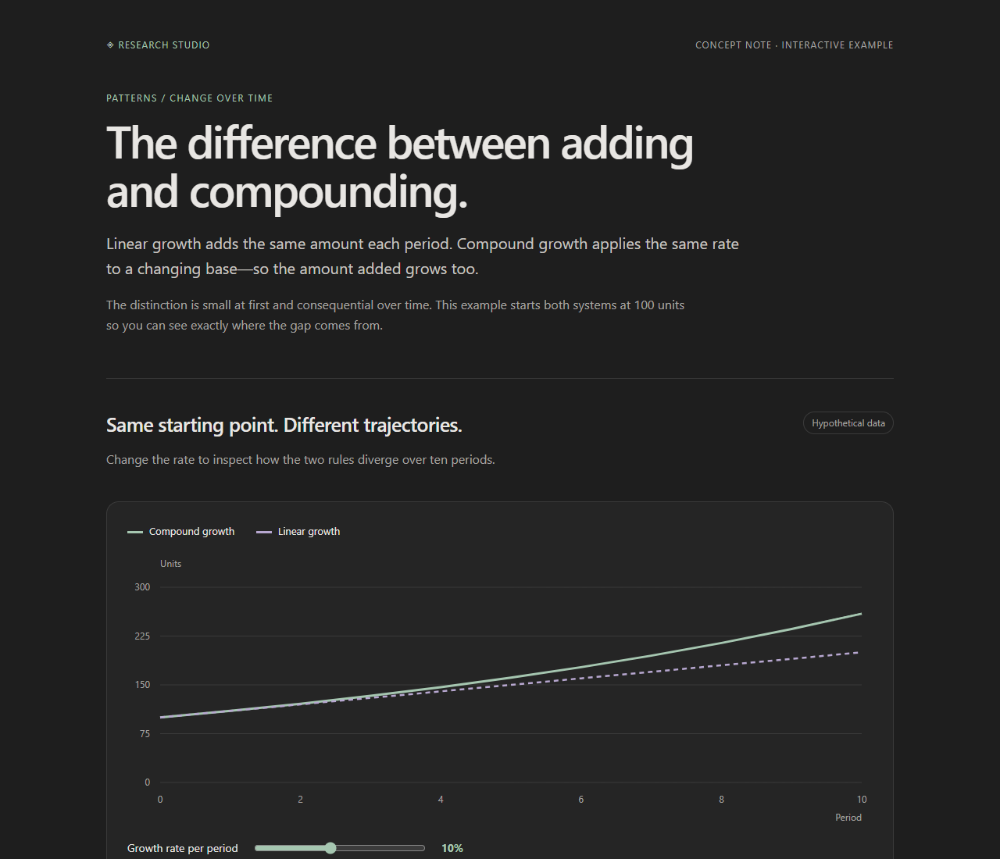

# Research Studio

Ask in Pi. Keep the conversation, sources, attachments and visual reports in your Obsidian vault.

Studio combines **Pi Web Access**, **Visual Explainer**, **Feynman's research roles**, and the optional **Pi Agent for Obsidian** interface. It opens with `/studio` and stays inactive in ordinary Pi sessions.



## Install

Requires Pi 0.85.x and Node 22.22 or newer, below Node 26.

```sh
pi install git:github.com/BasamAhmed640/pi-research-studio
```

Restart Pi or use `/reload`, then link an existing Obsidian vault:

```text
/studio vault "C:\path\to\Your Vault"
/studio ask Explain this company and its recent performance, with a useful visual report.
```

Choose the **vault root containing `.obsidian`**, not an ordinary subfolder. Linking is required. You choose the vault; installation does not pick or move one. Use `/studio exit` before linking a different vault. Existing material stays in its original vault.

## Ask and Deep

| | Ask | Deep |
| --- | --- | --- |
| Purpose | A focused, complete explanation | A broader investigation with competing evidence |
| Lead | Your selected Pi model | Your selected Pi model |
| Thinking | Caps the initial level at low | Restores the thinking preference captured when Studio opened |
| Assistants | None | Up to four calls per message, at most two at once |
| Sources | Check what the answer needs | Research distinct questions, draft, verify, then reconcile |
| Visuals | Full report when useful | Full report when useful |

Use `/studio ask` or `/studio deep` to switch in the same conversation. Append a question to either command, or type naturally afterward. Ask is designed to be quicker; there is no fixed response-time guarantee. Provider latency, reasoning settings and source retrieval still matter.

The lead explains the answer and remains responsible for it. Deep can invoke a **researcher** to gather passages and sources, a **verifier** to check claims against originals, and a **reviewer** for difficult disagreements or coverage gaps. These are Feynman's role instructions running in native Pi sessions, not the full Feynman app. Each child gets a focused brief, the same selected model, read/web/PDF tools, its own context and an eight-minute limit. No recursive delegation. Narrow follow-ups can stay with the lead. There is no mandatory fleet or extra model call in Ask.

The instructions require substantive explanations: conclusion, necessary context, mechanisms, concrete examples, evidence and uncertainty. Citations must support the claim rather than merely discuss the same topic. Those instructions and independent checks reduce avoidable errors; they do not guarantee correctness.

## Presentation

Substantial answers use Visual Explainer's **full HTML** path, with a dark charcoal background, clear typography, meaningful tables, charts, diagrams, explanation and source links. Charts should have readable labels and an interpretation. The quick renderer is reserved for explicitly requested small visuals. Simple facts and short follow-ups stay as text.

Interactive reports are saved in the vault and **open in your browser**. Obsidian holds the files and reads the Markdown conversations; it does not natively execute arbitrary HTML reports. Mermaid and chart libraries can be used in full reports. Reports should include readable text/data fallbacks for unavailable scripts. No Obsidian plugin is required for this main workflow.

See [the self-contained presentation example](examples/growth.html). It demonstrates layout and interaction with explicitly hypothetical data, not the output of a live research benchmark.

## Commands

| Command | What it does |
| --- | --- |
| `/studio` | Open a new native Pi research session; show help if already open |
| `/studio help` | Show commands and explanations |
| `/studio vault "path"` | Link/relink the vault and copy the optional Pi Agent companion files |
| `/studio ask [question]` | Focused answer mode |
| `/studio deep [question]` | Research with optional Feynman assistants |
| `/studio here` | Activate in the current chat, including Pi Agent Full agent mode |
| `/studio web websearch` | Configure the upstream web provider |
| `/studio web search` | Browse stored web results |
| `/studio doctor` | Show component versions and current mode |
| `/studio exit` | Deactivate and return to the previous session when available |

The terminal shows elapsed time, tool activity and working assistants. Pi retains its streaming, Escape cancellation, steering, `/tree`, `/fork` and automatic compaction. Mode changes wait until the current answer finishes or is cancelled; ordinary Pi input is not blocked by Studio.

## Images, PDFs and context

Use Pi's native image attachment support with an image-capable model, or reference a local file path. Submitted images are copied into the vault archive. For PDFs, provide a file path and, when useful, relevant page numbers. Studio preserves the original and extracts selected pages: up to 12 pages/16,000 characters per call, files under 50 MiB. Scans need OCR elsewhere; text extraction cannot inspect a figure. Web PDF URLs are handled by Pi Web Access.

Native Pi manages the lead's context and compaction according to your Pi settings. Children have native auto-compaction enabled and receive focused briefs instead of copies of the whole conversation. Full session files remain available to reopen; assistants' findings remain in the vault. This package adds no vector database, separate memory daemon or automatic wiki-writing pass.

## Storage and optional Obsidian chat

```text
Your Vault/
  Research Studio/
    Start.md
    Conversations/   # readable notes, named after the question
    Sessions/        # native Pi JSONL, supports resume and branching
    Reports/         # full HTML visual explanations
    Attachments/     # submitted images and local PDFs
    Research/        # assistant findings and native child sessions
  .obsidian/plugins/pi-agent/  # optional companion
```

Only the vault pointer lives in `~/.pi/agent/research-studio.json`. Research content is not saved in the extension directory. Pi authentication, web-provider settings and upstream temporary caches retain their normal locations. Linking preserves existing Obsidian preferences and Pi Agent's `data.json`; it never enables a plugin automatically.

For an optional chat interface inside Obsidian, enable **Pi Agent** in Community plugins, configure its Pi executable, choose **Full agent** mode, and use `/studio here`. Pi Agent owns that interface and its own persistence. A chat activated with `here` keeps its original native session location while Studio writes a readable copy into the vault. Use `/studio ask` from Pi for vault-local native sessions.

## Footprint and verification

The custom integration is small and imports the upstream engines only after Studio opens. The complete Feynman application is excluded; only its MIT-licensed role files are vendored. Direct dependencies are pinned. An initial development install occupied about **61 MB of runtime dependency files**, excluding Pi itself; package-manager caches and platform differences add overhead.

```sh
npm ci --legacy-peer-deps --ignore-scripts
npm run check
```

For the full test suite, set `PI_STUDIO_SDK` to your installed Pi `dist/index.js`, then run `npm test`. Without it, SDK integration cases are explicitly skipped. Tests exercise actual Pi sessions, source-reading verification with a scripted provider, Visual Explainer's real MCP renderer, PDF extraction, vault containment, mode isolation and component integrity. They do not establish live-model answer quality or certify every Obsidian version.

This is an initial integration release. See [upstream attribution and exact scope](THIRD-PARTY.md).

The current npm audit reports an upstream `image-size` denial-of-service advisory through Visual Explainer's `pptxgenjs` dependency. Studio exposes the HTML MCP renderer, which does not import that PowerPoint exporter. The affected package is nevertheless installed as an upstream dependency; no patched npm release was available when this version was checked. PowerPoint export is outside Studio's integration. Details: [ICNS parser advisory](https://github.com/advisories/GHSA-w3rx-r6r6-pgpr), [JXL/HEIF parser advisory](https://github.com/advisories/GHSA-5p2g-fcmc-qvqq).
